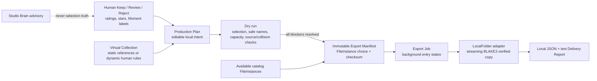

# Delivery Brain and Production Pipeline I

M9 turns explicit local human selections into verified local worksets without changing the source
shoot. It is a production organizer, not an autonomous editor: it does not create final selects,
edit/render media, infer creative value, upload media, or change Smart Cull decisions.

## Safe local workflow

1. Create or edit a plan from Client Delivery, Editor Workset, or Custom. Its rule builder uses
   current project-local human decision/rating/star/Moment facts; Studio advice is not a rule.
2. Choose an existing local destination folder and run a dry preview. The preview remains a
   compact UI projection: summary, blockers/warnings, and a few safe naming examples—not a
   100k-entry frontend payload.
3. Freeze a manifest only after the transaction rechecks current plan configuration and the
   decision/Moment/static-collection selection revision.
4. Run current preflight, then explicitly start the background export. Restarting resumes using
   actual content identity, not filename assumptions.

`ProductionPlan`, `ExportManifest`, and `ExportJob` are deliberately separate. A plan is allowed
to become stale; a historical manifest/job remains evidence of what was intended/executed at that
time. Export entry states distinguish pending, copying, verified, already-identical, blocked,
failed, and cancelled records. A partial job is never labelled completed.

## Naming and layout

`delivery-brain` is a pure local crate with no filesystem, database, decoder, customer media, or
network dependency. It selects a suitable available `FileInstance`, deterministically sorts the
selection, sanitizes names, detects case-insensitive internal collisions with a set, and produces
a checksummed manifest draft. Moment folder labels use human label, then a conservative stored
suggestion, then `Moment_###`; no event/person label is invented.

Supported initial strategies are preserve original, sequential, project sequence, Moment sequence,
and bounded safe custom template. Extensions are retained; M9 does not convert RAW/JPEG/video or
write sidecars. Sidecar/family packaging is a future policy boundary, not an invented Adobe
integration.

## LocalFolder adapter and recovery

The local-folder executor validates canonical containment for the selected root/source and
destination target, rejects symlinks, and never lets an unsafe relative path escape a selected
root. It uses the existing ingest verified copier: streaming BLAKE3 source and destination hashes
plus no-overwrite atomic finalization. Each plan defaults to a configurable 1 GiB safety reserve
(with a 128 MiB minimum) but never imposes an artificial maximum project, file, media, or storage
size.

External destination/source loss produces an honest blocked/partial outcome; previously verified
files are retained. Startup marks running exports interrupted so the user can resume a new job.
Only immutable manifest entries are retried, so new decisions cannot race into a prior export.

## Privacy and limits

All planning, source selection, copying, reports, and history are local/offline. Reports omit
notes, source paths, internal IDs, AI scores, Studio predictions, raw embeddings, and model data.
M9 intentionally has no cloud delivery, account, telemetry, web gallery, Lightroom/Photoshop/NLE
bridge, color/RAW editor, deletion, automatic final delivery, or video/audio intelligence.
