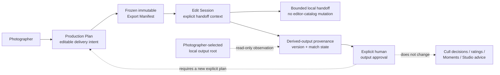

# Edit Sessions and derived-output foundation

Milestone 10 records a photographer-controlled local editing round trip without making CaptureOS
an image editor or a proprietary editor-catalog integration. It preserves the distinction between
what the photographer intends to deliver, what was handed off for editing, what appears later in a
local output folder, and what the photographer explicitly approves.

## Separate authority records

| Record | What it records | What it does not authorize |
| --- | --- | --- |
| Production Plan | Editable M9 human delivery intent, rules, organization, and destination policy | External editing state, output matching, approval, or automatic delivery |
| Export Manifest | Immutable M9 source/selection/naming snapshot for one verified-copy execution | Editing, rendering, future-plan updates, or approval of a derived output |
| Edit Session | A deliberately chosen edit-workset/handoff context and local output-review cycle, created from one frozen M9 manifest | Mutating a plan, an editor catalog, original media, culling state, or delivery authority |
| Derived output | Observed local output provenance, version/revision history, and match evidence | Replacing the original, asserting a creative recipe, or human approval |
| Output approval | A photographer's explicit local assessment of a particular observed output | Keep/Reject/Review mutation, auto-delivery, output deletion, or a new export manifest |

An Edit Session is created from one frozen M9 manifest, but it does not execute or re-evaluate
that manifest. A plan may have no Edit Session, and a session may have no observed output. Both
distinctions are important: a handoff is not a delivery, and an external file is not automatically
a finished or approved result.

## Local handoff and adapter boundary

CaptureOS provides a generic, file-oriented local boundary only. The photographer explicitly
chooses the session and any local output root. A session can carry bounded identifiers and an
immutable source snapshot, but CaptureOS does not open, create, modify, or rely on a proprietary
editor catalog/database. It does not automate an editor UI, import into an editor, write XMP or
sidecars, or change original metadata.

Any physical source handoff continues to use the existing M9 safe-copy model where applicable:
only catalog-approved available `FileInstance` copies are selected, source media stays read-only,
and no destination file is silently overwritten. The Edit Session boundary itself has no source
write, rendering, color/RAW development, retouching, transcode, or external-application control
authority.

## Derived-output provenance and matching

An observed output is a separate local record. Its provenance preserves the session that observed
it, its local file identity/fingerprint when available, timestamps, the source candidates and
evidence considered, its matching state, and a version/revision relationship when one is known.
Later observations create or retain history instead of relabeling an earlier output as though it
were always the newest version.

Matching is conservative:

- CaptureOS may record an exact or manual output link only when stored local evidence identifies
  one eligible session source unambiguously.
- A `strong` or `possible` candidate remains a suggestion with its evidence; it is never an
  approval or a replacement for the source.
- Filename, timestamp, visual/semantic resemblance, or an external editor assumption alone is
  insufficient for a final link.
- Conflicting evidence remains **Ambiguous**; missing evidence remains **Unmatched**.
- A match says only that the documented local provenance supports a link. It does not describe
  the edit, prove creative intent, identify a person, or declare that the output is better.

The normal workspace receives compact status/history projections. It never loads a whole output
folder, raw fingerprint corpus, or proprietary catalog into the frontend.

## Approval and delivery

Approval is an explicit human event on a specific derived-output version. It is separate from
matching and from M5/M8/M9 authority. CaptureOS does not infer approval from the source's Keep
state, a star/rating, an external application's state, a Studio recommendation, a file's presence,
or an untouched suggestion.

Approving an output does not change source media or existing review data, and it does not send the
output anywhere. If the photographer later wants delivery, they create or refresh a normal M9
Production Plan and immutable Export Manifest. This preserves an auditable boundary between edit
review and verified local delivery.

## Privacy and out-of-scope work

Session manifests, output roots, output fingerprints, matching evidence, versions, approvals, and
any available output metadata remain sensitive local data. CaptureOS does not upload, telemeter,
or automatically export them, and client-facing reports omit private paths, internal IDs, notes,
AI/Studio evidence, and matching internals.

M10 does not add cloud editing, accounts, collaboration, a Lightroom/Capture One/NLE catalog
adapter, direct proprietary-database mutation, automatic import/export, actual rendering or
editing, source write-back, automatic culling, automatic approval, deletion, or video/audio
editing intelligence. See [the M10 security boundary](../security/edit-sessions.md) and ADRs
[066](../adr/066-edit-session-and-production-plan-boundary.md),
[067](../adr/067-derived-output-provenance-versioning-and-approval.md),
[068](../adr/068-local-editor-adapter-output-matching-and-privacy.md), and the M11 read-only
history ADR [069](../adr/069-edit-history-and-provenance-review-i.md).

## Edit History and Provenance Review I (M11)

M11 is a read-only, deterministic history experience over the append-only `edit_session_versions`
records that M10 already persists. A user opens an output in an Edit Session and views a
chronological version timeline with provenance, source/match state, review/approval state, and
online/offline availability. M11 never edits, restores, renders, writes back, or mutates any
source, output, version, or history record; it queries only existing M10 data scoped to one
edit session and project, preserves append-only history when outputs go offline or reappear, and
never creates false versions. See ADR
[069](../adr/069-edit-history-and-provenance-review-i.md) and the M11 rules in
[AGENTS.md](../../AGENTS.md).
