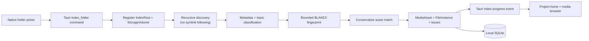

# Milestone 1: Local Media Engine

CaptureOS Milestone 1 implements local, read-only Index Mode. The user selects a folder in the Tauri desktop shell; React never walks the filesystem. The Rust core owns discovery, lightweight inspection, classification, fingerprinting, issue capture, and SQLite persistence.

## Source safety

The pipeline uses directory listing, metadata inspection, and read-only file handles only. It does not copy, rename, modify, delete, format, follow symlinks, execute metadata, or invoke shell commands with selected paths. The local SQLite catalog lives outside selected media folders.

## Classification

Basic classification uses normalized extensions only in M1: common RAW names, JPEG, HEIF, PNG, TIFF, MOV/MP4/M4V/AVI/MXF, WAV/MP3/M4A/AAC/AIFF, XMP/SRT/XML/JSON, and unknown. It is intentionally not content or MIME validation.

## Volume association

`StorageVolume` and `IndexRoot` are deliberately independent. A `StorageVolume` represents the mounted filesystem; an `IndexRoot` is a user-selected folder associated with a project. Several roots can therefore share one volume. On macOS the storage adapter uses native filesystem attributes for a volume name, mount root, filesystem type, capacity, and device fallback when available; the persisted CaptureOS volume record has its own stable ID and reuses the existing `unix-device:*` identity while mounted. The UI renders **Storage** and **Root** in separate columns.

Index Mode is additive: indexing another selected folder in the same project creates or reuses an `IndexRoot` and does not remove files from earlier roots. Reindexing affects availability only within that root. Remove-root semantics are intentionally later work.

## Pagination and scale

The media browser asks SQLite for one page at a time (currently 250 rows). That is a UI page size, not a catalog or storage limit. The catalog and indexer enforce no artificial file, project, folder, or byte limits.
