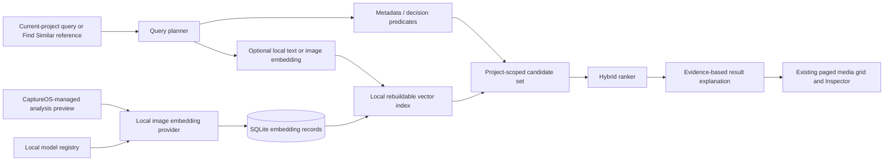

# Magic Search architecture

Magic Search is CaptureOS’s current-project visual retrieval layer. It is local-first, private, non-destructive, and photo-only in Milestone 6. It combines a shared image/text embedding space with existing deterministic evidence; it is not a chatbot, an object detector, an identity system, or a replacement for human culling.

## Query flow

`SearchService` owns project isolation, result pagination, history persistence, and the non-destructive search session. `QueryPlanner` recognizes only confident structured terms and leaves the remainder as semantic text. `SemanticEmbeddingProvider`, `VectorIndex`, `MetadataSearchProvider`, `HybridRanker`, and `SearchExplanationProvider` are replaceable adapters. The React UI does not bind directly to a particular model, vector-index implementation, or hard-coded vocabulary.

## Evidence and query planning

The planner can extract supported high-confidence predicates such as face count (`1 face`, `2 faces`), rating (`5 star`, `4+ stars`), human decision (`kept`, `rejected`, `review`), technical evidence (`sharp`, `blurry`, `technical issue`), and camera model (`camera SLT-A58`). The non-structured remainder is eligible for a semantic text embedding when a local provider is available. Unknown language is not assigned a fabricated intent.

The ranker uses only the signals the plan actually selected: vector similarity, deterministic filters/boosts, or both. It never presents similarity as a probability. A semantic-only explanation says **Strong semantic match**. It may additionally list `Faces: 2`, `Rating: 5`, or `Decision: Keep` only when that stored evidence was applied. It must not invent object labels, locations, person identities, or detections from an embedding score.

Search is current-project only. `Find Similar` uses a selected asset’s image embedding as the query vector and returns semantic visual neighbors in the same project. It remains separate from a `SimilarityGroup`: Similar Sets are conservative related-frame/burst groups with their own provenance and are never created, altered, or deleted by semantic retrieval.

## Local model contract

Magic Search’s candidate model is product ID `google-siglip-base-patch16-224`, sourced from [`google/siglip-base-patch16-224`](https://huggingface.co/google/siglip-base-patch16-224), through an opt-in, manually installed static ONNX pack. CaptureOS does not bundle, auto-download, or silently convert model weights. The upstream model card labels its source code/weights Apache-2.0; the exact immutable model revision, source-weight provenance, conversion provenance, per-file checksum, license reference, and tokenizer must still be recorded and checked for every installed pack. See [the local model registry](local-model-registry.md) and ADR 044.

The provider contract expects separate static image and text ONNX encoders plus the matching tokenizer, producing 768-dimensional vectors in one shared space. The managed analysis preview is oriented then resized to the admitted provider’s recorded raster; the current candidate uses 224×224 RGB, `/255`, and mean/std `0.5`. Text is Unicode-normalized/lowercased, tokenized with the admitted pack’s tokenizer, and padded/truncated to 64 tokens. These settings are versioned and must pass reference-vector validation before a provider is marked available. CPU inference uses the local `tract-onnx` runtime; no browser, Python interpreter, pickle payload, model script, GPU service, or network endpoint is accepted.

When no admitted pack is installed, Magic Search retains deterministic metadata/technical filters and clearly reports **Semantic search model unavailable**. It does not substitute filename matching, tags, or arbitrary vectors as semantic results.

## Embeddings and index lifecycle

An embedding belongs to a logical `MediaAsset`, not to each physical `FileInstance`. Its cache/provenance identity includes MediaAsset ID, managed-preview input fingerprint, model ID, model version, preprocessing/embedding version, generated timestamp, terminal state, and error where applicable. A source or model/preprocessing change makes old records stale rather than silently comparing incompatible vectors. Existing READY embeddings remain useful when a source disk is offline; if no sufficient managed preview or source is available, the item becomes `NEEDS_ORIGINAL` for semantic indexing without blocking other assets.

The durable SQLite embedding record is the source of truth. A project-scoped vector index is a versioned, derived artifact that can be deleted and rebuilt from compatible READY embeddings. It is not a source of project identity, Catalog membership, CaptureGraph facts, or human decisions. The index boundary supports an exact small-project baseline and a scalable local approximate implementation without changing query/service contracts; it must not degrade into a hidden full-catalog scan for large projects.

Embedding work uses the existing durable Capture Intelligence resource modes and pause/resume behavior. It prioritizes visible/recent/current-project work but must not starve the remaining eligible project assets. `READY`, `UNSUPPORTED`, `CORRUPT`, `NEEDS_ORIGINAL`, and `FAILED` are per-asset terminal outcomes, so one bad input cannot hang the queue.

## Data and privacy boundary

Customer originals are read only when no reusable CaptureOS-managed analysis preview exists; semantic inference itself receives only a canonicalized managed preview path. Text queries, embeddings, model metadata, search history, index artifacts, and result explanations stay on the local computer. They are potentially sensitive derived data and are never uploaded, telemetered, exported automatically, or used for training.

Magic Search performs no person recognition, cross-project identity matching, demographic inference, face clustering, creative judgment, emotional scoring, video semantic search, or audio semantic search. Face counts may be used only as already persisted anonymous technical evidence. Clearing/rebuilding a semantic index must preserve catalog records, preview artifacts, Capture Intelligence evidence, Similar Sets, and human decisions.

## Evaluation

[MagicSearchBench](../../research/magic-search-bench/README.md) holds generated-fixture scale measurements and versioned text/image ground-truth schemas. It measures local query/index behavior at 1k, 10k, and 50k synthetic embedding records without claiming semantic quality. Semantic Recall@K, MRR, nDCG, embedding latency, and hybrid effectiveness require an admitted model pack and a separately licensed, versioned public or generated benchmark dataset.
