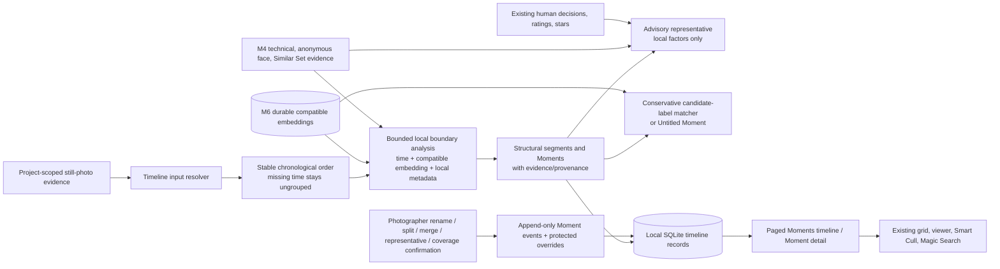
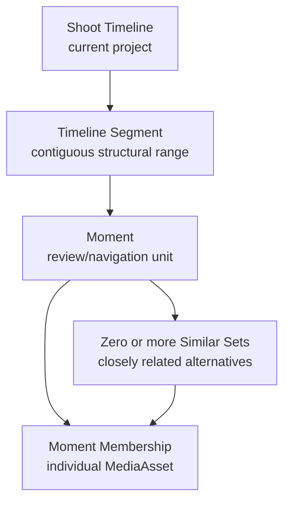

# Moment Brain and Shoot Timeline Intelligence I

Moment Brain is CaptureOS’s local, current-project still-photo timeline organization layer. It turns durable, already-local evidence into conservative **structural** segments and Moments. A Moment is a useful review/navigation unit, not a claim that CaptureOS knows the event, the people, the relationship, the photographer’s intent, or a required shot.

Milestone 7 is private, offline-capable, non-destructive, and explicitly separate from Similar Sets and Magic Search. It does not recognize people, infer wedding stages, judge creative quality or emotion, alter media, decide a cull, correct EXIF, create a cloud request, or analyze video or audio.

## Flow and boundaries

**moment-brain** is a pure analysis boundary. **capture-core** coordinates durable jobs and project ownership; **persistence** owns migration and relational checks; the desktop bridge supplies only validated project/asset/moment IDs and renders paged results. The React UI never chooses a model, compares vectors, or trusts an unscoped client-provided Moment ID.

## Hierarchy

The diagram describes containment/navigation, not an event ontology. A Moment can contain several
Similar Sets and standalone assets; a Similar Set remains a narrower M4 related-frame/burst
recommendation with independent provenance and human representative state. Moment analysis does
not create, delete, merge, or rewrite Similar Set membership.

## Local persistence and rebuild source

Schema migration **012** is additive and leaves the legacy Phase 0 **shoots** and **moments** scaffold untouched. It introduces:

- **shoot_timelines** and immutable **moment_analysis_runs** for project/run/model/input provenance;
- **timeline_segments**, **moment_records**, **moment_memberships**, and **moment_boundary_evidence** for derived structural projection;
- **moment_human_labels**, **moment_human_representatives**, **moment_override_operations**, and append-only **moment_events** for protected photographer authority;
- **coverage_checklist_items**, **coverage_confirmations**, and **camera_clock_offset_diagnostics** for factual Coverage Map I support.

The active projection can be rebuilt from durable catalog/analysis evidence. It marks old derived rows stale and never repurposes legacy Moment rows, deletes M0–M6 evidence, or destroys the separate human event/override anchors. Membership rows, rather than a display time range alone, define a Moment after a protected merge/split. Centroids are local derived blobs with compatibility/dimension provenance; they are never exposed as raw UI data or treated as project identity.

## Timeline inputs

### Capture-time provenance and repair

M7.1 adds a separate, explicit local **Refresh metadata** worker for previously indexed projects.
It reads available source containers without modifying them, records per-copy observations, and
updates only the logical metadata projection. It does not create previews, invoke a model,
regenerate Magic Search embeddings, alter Similar Sets, or change Capture Intelligence/M5 human
records. The project remains open and usable while that worker runs. A photographer then chooses
**Rebuild** to create a new derived Moment projection from the refreshed chronology.

The resolver prefers embedded original-capture evidence (including valid subsecond/offset data),
then supported embedded fallback fields and supported platform content-creation metadata. A
filesystem time is retained only as an explicitly low-confidence fallback; it never silently
becomes camera capture time. Unknown-offset EXIF remains a local wall-clock value with an explicit
unknown timezone. Moment Brain may use an internal local ordering coordinate, but Moment cards
preserve the original local string rather than displaying invented UTC. Conflicting embedded
values across available copies create a Developer Details diagnostic; normal UI remains concise.
See [ADR 057](../adr/057-capture-time-provenance-and-refresh.md).

The resolver reads only durable, local project records for still-photo **MediaAsset**s:

| Evidence | Permitted use | Important limit |
| --- | --- | --- |
| Capture timestamp and camera/lens/orientation metadata | Stable ordering, adaptive cadence, weak transition evidence | It is metadata, not event truth; missing/unreliable time is not guessed. |
| Compatible current M6 image embeddings | Adjacent/rolling visual continuity, representative/label candidate ranking | A vector similarity is not a detector, caption, identity, or proof of a concept. |
| M4 Similar Set continuity | Weak related-frame continuity evidence | M7 never creates, alters, merges, or deletes a Similar Set. |
| Technical evidence | Transparent representative tie-break/supporting factor | It is not aesthetic or creative judgment. |
| Existing anonymous face count/status | Weak structural signal and factual summary | Never identity, matching, person clustering, or demographic inference. |
| Existing human Keep/Review/Reject, rating, star | Optional representative presentation factor and factual summary | Search/timeline analysis never changes human decisions or their history. |
| Human checklist/project phrase | Optional label candidate only | It is a photographer-provided expectation, not a detected event or auto-complete rule. |

Original media bytes are not a timeline input. Moment analysis does not repeatedly decode originals or require a mounted source when current durable metadata, cached preview-derived evidence, and compatible embeddings already exist. If evidence required for a new asset is unavailable, that asset retains an honest unavailable/ungrouped state while other project work continues.

## Structural segmentation

Analysis first creates one stable chronological stream using capture time and a deterministic asset-ID tie-breaker. Missing timestamps are excluded from chronological grouping and explicitly shown as ungrouped/uncertain. The current analysis is bounded to adjacent records plus a small, fixed local context; it is not an all-pairs catalog scan.

For each possible boundary, the analyzer records only the evidence it actually had:

- **Capture cadence:** an adaptive local gap derived from observed project/camera cadence, not a single universal wedding/session timeout.
- **Visual continuity:** compatible local embedding distance and a bounded rolling centroid where the semantic provider/model/preprocessing identity agrees.
- **Supporting metadata:** camera, lens, orientation, optional anonymous face-count transition, and Similar Set continuity as weak local evidence.

Unavailable signals do not become zeros disguised as certainty. Their weights are omitted or renormalized according to the analyzer version, and Developer Details records their unavailability. Normal UI uses qualitative language such as **Strong boundary**, **Moderate boundary**, or **Continuous sequence**. It does not expose a fake probability, exact event classification, or claim that an object/person is present.

The first M7 pass may initially represent a contiguous segment as one Moment. The persisted model keeps segment and Moment concepts separate so later, explicitly approved work can improve organization without redefining historical human choices. A moment's derived centroid is project-local, versioned derived data; durable per-asset embeddings remain the rebuild source of truth.

## Conservative suggested labels

The approved M6 SigLIP provider is a shared image/text embedding encoder, not a generative
captioning model. Moment Brain consequently keeps its closed candidate-label policy separate
from **SemanticEmbeddingProvider**: core supplies only reviewed generic candidates or exact
photographer-provided phrases with compatible local text vectors; the pure engine never accepts
unrestricted generated label text.

The initial local provider can score only a reviewed generic descriptive vocabulary that CaptureOS can plausibly support, such as **portrait**, **portraits**, **group**, **indoor**, **outdoor**, **water**, **boat**, **close-up**, **wide scene**, **one person**, and **multiple people**. It may combine supported high-margin concepts into a concise descriptive label, for example **Outdoor portraits** or **Boat portraits**. These examples describe the contract; they are not AI Test rules, wedding templates, detector results, or a hard-coded event taxonomy.

Photographer-authored project/checklist phrases are additional candidate text only. If a candidate such as “Couple portraits” is supplied by the photographer and the local embedding evidence meets the same conservative threshold, it may be offered as an AI suggestion. CaptureOS must not invent that relationship, and it must not auto-complete the checklist.

The label provider abstains whenever evidence is weak, ambiguous, conflicting, model-incompatible, or unavailable. The normal label is then **Untitled Moment**. The normal UI shows only the concise label; Developer Details may list the candidate concepts, source (reviewed vocabulary or photographer phrase), provider/model/version, score band, margin, and availability state. It never turns a ranking signal into a detection confidence.

AI suggested label, label method/model/provenance/evidence, and human label are persisted separately. A human rename is authoritative for presentation and never overwrites or relabels the historical AI suggestion.

## Representatives and human organization

An AI representative is advisory. Its transparent, versioned factors may include Moment-central visual continuity, available technical-evidence band, and existing Keep/rating/star display signals. It must say only what those factors support; it is not “the best photo,” a composition or emotion judgment, or a culling result.

The human representative is separate from the AI representative and uses its own durable record. The same separation applies to existing M5 Similar Set representatives. A Moment action never changes a Similar Set's AI or human representative.

Meaningful photographer actions append local **MomentEvent** evidence, including:

- **MOMENT_CREATED**
- **MOMENT_RENAMED**
- **MOMENT_MERGED**
- **MOMENT_SPLIT**
- **MOMENT_REPRESENTATIVE_CHANGED**
- **COVERAGE_CONFIRMED**

Current override projections are indexed for display, but the append-only event remains the audit record. Split/merge operations are anchored to concrete project asset IDs/membership boundaries, not a fragile frontend ordinal. Reanalysis creates a new derived run and overlays protected human operations; it never silently discards a photographer's label, merge, split, representative, or coverage confirmation.

## Coverage Map and multicamera diagnostics

Coverage Map I is an observational review tool. It can report factual asset totals, observed capture-time ranges/gaps, technical-evidence distributions, anonymous face-count availability, decision summaries, and human checklist state. “No capture activity from A to B” is a time-series observation. It must never claim that a required shot, person, event, or creative moment is missing.

A photographer creates and owns the checklist. Magic Search may find local candidate media, but only the photographer can set an item to confirmed, needs review, or not covered. An item is never automatically completed from a semantic score or Moment label.

For multiple cameras, M7 may surface a **Possible camera time offset** diagnostic from local
timestamp distributions and existing related-frame evidence. It is advisory and has no write-back
path: CaptureOS does not rewrite EXIF, source files, catalog timestamps, or embedded metadata.
The implementation admits only one nearest distinct-camera pair per existing Similar Set and
requires at least three independent, tightly agreeing pairs with a median difference of at least
one minute. Conflicting or insufficient evidence is absent rather than represented as aligned
clocks. Diagnostics are tied to the active completed run; after a bounded tail update they abstain
until a full evidence pass can establish a current observation.

## Background and incremental lifecycle

Moment analysis is an explicit durable background job with project-scoped progress, pause/resume,
terminal error records, and resource mode. It must return control before inference/index work
starts and must never run implicitly during application startup or project opening. The Project
Home requests only a cheap status projection; a user chooses Analyze, Update, or Rebuild. ECO,
Balanced, and Fast alter only deterministic local input-materialization batch/yield cadence
(smaller/more yielding through larger/less yielding); they do not change evidence ordering,
thresholds, candidate vocabulary, label policy, or structural outcome.

An incremental update reevaluates a bounded chronological tail/window around new compatible records. The background worker obtains that context through the repository and passes only it plus the append batch to **analyze_append_only_tail**; it does not sort a full project simply to measure a tail. The full-input incremental validator remains a conservative compatibility/fallback path. An out-of-order timestamp, model/version incompatibility, changed input fingerprint, incomplete tail declaration, or invalidated window may conservatively require a rebuild. A rebuild only replaces derived current analysis records; it preserves historical provenance and overlays human override anchors. It cannot block browsing, Magic Search, Smart Cull, Capture Intelligence, or an unrelated project's job queue.

## Search, culling, and isolation

Moment detail may open the existing paged media grid, viewer, Magic Search, and Smart Cull in a validated project/Moment membership scope. The server rechecks that every asset and Moment belongs to the selected project. A date range alone is insufficient because human merge/split overrides can make a Moment differ from its original contiguous range.

Moment scope is navigation/read-only context, not a new culling decision state. M5 current decisions/history, notes, ratings, representative selections, review sessions, and Similar Set membership remain unchanged by analysis. Find Similar stays selected-asset-to-selected-asset local visual retrieval and does not become a Moment similarity system.

## Privacy, rebuilding, and evaluation

Timeline rows, local centroid/label evidence, boundary evidence, human checklist text, and model provenance are sensitive local derived data. They remain project-scoped in SQLite, are never sent to a service or automatically exported, and are rebuildable from durable local evidence plus explicit human events. They are never the sole source of project identity, original-media location, or human decision history.

[MomentBrainBench](../../research/moment-brain-bench/README.md) uses deterministic generated timeline records at 1k, 10k, 50k, and 100k scale to compare time-only, semantic-only, and combined boundary mechanics. Its synthetic numeric signatures are not photographs or model outputs; its precision/recall/F1 and segment purity are structural fixture metrics only. Product migration, project isolation, offline, human-override, UI, and no-mutation behavior require separate tests.

## Explicit non-goals

Milestone 7 does not add People Brain, identity recognition, face matching, person clustering, demographic inference, event recognition, wedding-stage templates, creative/emotional judgement, automatic culling, source write-back, deletion, cloud inference, paid APIs, collaboration, billing, video/audio intelligence, or other Milestone 8 work.
