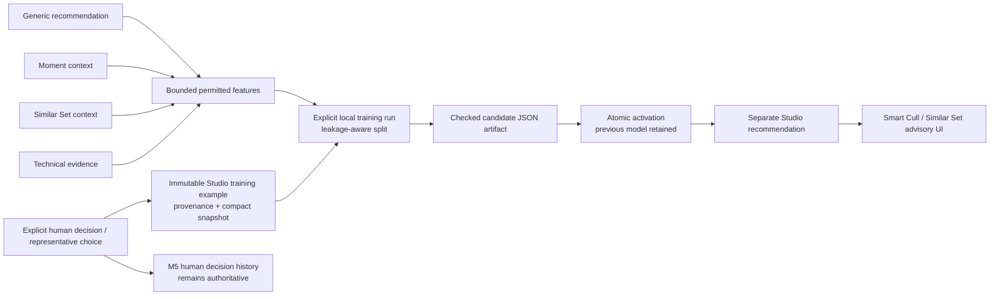

# Studio Brain I architecture

Studio Brain I is a local, explicit, photographer-specific advisory layer for culling. It learns only from intentional human review evidence and produces **Likely Keep**, **Likely Review**, **Likely Reject**, or **Not enough evidence**. It is not an automatic selector, a generic artistic judge, a client/person model, or a cloud service.

## Scope and authority

Studio Brain consumes existing local evidence but does not replace Capture Intelligence, Magic Search, Moment Brain, or human review. It never changes a culling decision, rating, star, note, human representative, Moment, checklist, original file, source metadata, or export. `REJECT` remains CaptureOS-local, non-destructive metadata.

The default profile is `local-default` (`StudioProfile`), while the schema scopes every example, run, model, exclusion, event, and recommendation to a profile so future local profiles cannot leak into one another. Profile opening reads a compact status only; it never backfills, trains, or blocks project startup.

## Preference-source boundary

Only explicit actions create source records:

- Keep, Review, and Reject changes from immutable M5 decision history;
- rating and star changes, retained as auxiliary explicit signals rather than silently coerced into a culling class;
- M4 human overrides where they are actual human decisions; and
- human Similar Set and Moment representative choices. Similar Set choice becomes pairwise `chosen > alternative` evidence; it never means every alternative is rejected.

Opening/viewing/searching/hovering/zooming, AI recommendations, indexing, and inactivity are never sources. Notes are retained by M5 but never selected, parsed, or modeled by Studio Brain. Historical backfill is idempotent and happens only after the photographer presses Train/Update; legacy presentation state remains `unknown`, never reconstructed from current UI state.

Project contribution defaults to enabled, but an explicit project opt-out blocks both new source materialization and historical backfill. It does not delete decisions and does not prevent an already-active local model from being used for recommendations. A `decision_training_exclusions` row is the foundation for excluding one anomalous source record; it also never rewrites M5 history.

## Feature catalog (v1)

The model accepts a small static vector (31 values including explicit availability indicators). It never stores or receives an original path, filename, private note, raw semantic vector, identity, demographic field, protected trait, person crop, or source-media bytes.

| Feature family | Local source | Missing behavior | User-facing explanation |
| --- | --- | --- | --- |
| Technical score, sharpness, directional blur | current/stored `technical_quality` snapshot | value unavailable plus availability indicator | technical strength, sharpness, blur only when present |
| Exposure | reserved v1 input; no fabricated value when unavailable | unavailable indicator | none until supported evidence is present |
| Anonymous face count and open-eye count | local `face_analyses` | zero is a count; analysis absence is encoded separately | anonymous face/eye evidence only when available |
| Similar Set size and technical rank | active local Similar Set membership / compact source snapshot | no group means unavailable | relative technical position in a set |
| Relative sharpness / centroid rank | reserved v1 inputs | unavailable indicator | none until real evidence is available |
| Moment size and ordinal position | active local Moment membership / compact source snapshot | no Moment means unavailable | modest within-Moment context only |
| Timeline boundary score | reserved v1 input | unavailable indicator | none until supported evidence is present |
| Generic recommendation / representative | current generic recommendation and explicit representative state | unavailable one-hot state | generic agreement/disagreement, never hidden |
| Semantic availability | compatible local embedding status only | unavailable boolean | availability only; no raw vector or object claim |

Numeric normalization is fit only from the training partition and embedded in the model artifact. Missing values are represented by paired availability inputs rather than replacing absent evidence with a meaningful numeric zero. Capture time is used only as a leakage-safe fallback grouping key, never as a preference feature.

## Model, readiness, and evaluation

`studio-brain` is a pure Rust crate using a deterministic, regularized three-class linear softmax classifier with temperature calibration and abstention. A small pairwise linear ranker is trained separately only from explicit Similar Set representative comparisons. The choice is deliberate: the initial data set is small, structured, locally retrainable, compact, inspectable, and does not require Python, an LLM, a model download, or a high-dimensional embedding dump.

Readiness is multi-factor rather than one count: eligible culling decisions, at least two supported classes, examples per class, project diversity, Similar Set evidence, feature coverage, a non-empty leakage-aware holdout, macro-F1, and Brier score. Default conservative thresholds are encoded in `StudioTrainingConfig` (48 eligible decisions, 2 classes, 8 examples/class, 2 projects, 8 Similar Set choices, 55% feature coverage, and 12 holdout examples). A short or one-project history can remain **Learning** or **Not ready** even after training is requested; that is an honest result, not a failure to lower the bar.

Whole projects are held out when two or more projects exist. For a one-project history, Similar Set, Moment, then capture-day buckets remain intact. An unavailable grouping produces no validation-quality claim. The same grouped candidate holdout chooses calibration temperature and reports candidate metrics, so it is an activation safeguard—not independent real-world efficacy evidence. The benchmark calls comparisons *held-out agreement*, never photographer-world accuracy.

Predictions abstain to **Not enough evidence** when confidence/margin is inadequate and use restrained high/moderate/low bands rather than faux precise percentages. Explanations are derived from actual non-missing feature contributions. They may say “among the sharper frames in this Similar Set,” not “you love this pose” or any unsupported psychological inference.

## Training and model lifecycle

Training is explicit. It creates one profile-scoped durable background job and an immutable run snapshot containing source IDs, compact feature snapshots, split, labels where applicable, algorithm/version, parameters, feature schema, and snapshot hash. A partial unique index prevents simultaneous in-flight runs per profile.

1. Materialize eligible explicit local source rows idempotently.
2. Snapshot and leakage-aware split the eligible rows.
3. Fit/evaluate a compact candidate and serialize static JSON with model schema, normalizer, calibration, and checksum.
4. Validate the candidate before storage; persist its metric summary and candidate recommendations while the previous active model remains active.
5. Re-hash current eligible sources. A monotonic source revision is captured before/after the read and checked again inside the final SQLite write transaction. Each authoritative human action writes an action-scoped durable source guard in the same SQLite transaction as its append-only history; activation and snapshots refuse while any guard remains. Successful live capture resolves only its own guard, and explicit historical reconciliation resolves durable leftovers atomically, so a candidate that missed a just-recorded choice stays inactive.
6. Atomically mark the candidate active, mark the former model `previous`, retire old advisory rows, complete the run, update profile state, and complete its durable background job.

Candidate artifact validation is repeated at storage, activation, and active-model load. A corrupt active artifact becomes unavailable/error, its advice is hidden, and CaptureOS falls back to generic evidence without crashing the project. Reset marks only derived models/recommendations reset/stale and preserves all human decisions, technical evidence, semantic data, Moments, and source files. The retained `previous` model is the rollback foundation; a direct previous-model revert UI is intentionally deferred.

Any material change to a consumed technical, generic-recommendation, face, semantic-availability, Similar Set, or Moment input marks relevant persisted Studio advice stale. Recompute is an explicit later update, so current evidence is not represented as if it were old model input.

## Recommendations and surfaces

`StudioRecommendation` is a separate local projection keyed by profile, model, project, MediaAsset, feature schema/fingerprint, generic snapshot, confidence band, agreement state, factors, and generation time. It never becomes a source label. Smart Cull shows generic Capture Intelligence and Studio Brain as distinct sections. Similar Sets can show a Studio starting point produced by the separate pairwise ranker, beside—not instead of—the technical starting point and human representative. Magic Search ranking is unchanged.

## Privacy, integrity, and research

Everything stays on the local device and works offline after training. Model artifacts are structured JSON, versioned, checksummed, and rebuildable from durable human-source records. There is no arbitrary code deserialization, pickle, model hook, cloud training, remote vector database, telemetry, or automatic export.

`StudioBrainBench` uses deterministic generated preference fixtures only. Its research question is: *Does a lightweight, locally trained photographer-specific preference model improve agreement with held-out culling decisions compared with generic technical ranking alone?* Synthetic recovery and scale measurements are not real-photographer accuracy claims. Any future study needs explicit consent, a separately reviewed dataset/license/privacy plan, and must not commit private customer decisions, notes, images, or paths.

Project deletion policy is intentionally not invented here: before project deletion is implemented, its handling of retained Studio source/run provenance needs a dedicated approved policy. M8 does not silently preserve deleted-project preference data.
