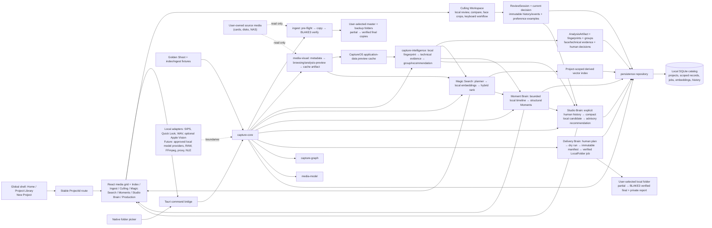
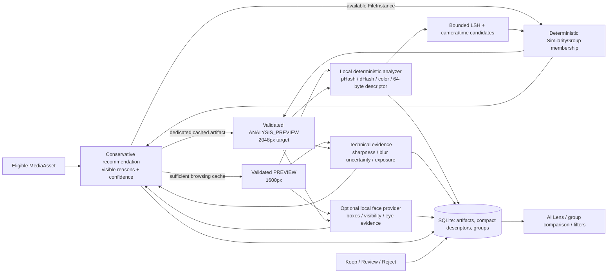
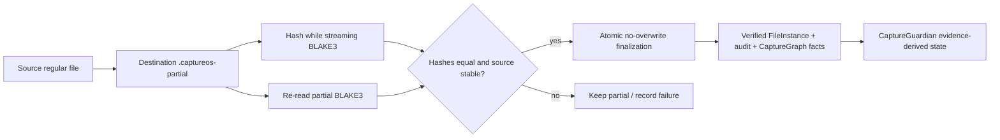

# System architecture

CaptureOS uses a desktop-first, local-only architecture. React uses Tauri commands and events; the Rust core owns the domain model, migrations, repositories, read-only Index Mode, verified Ingest Mode, visual preparation, Capture Intelligence, Milestone 6 Magic Search, Milestone 7 Moment Brain, Milestone 8 Studio Brain, and Milestone 9 Delivery Brain orchestration. SQLite stores catalog information locally; it never stores original media bytes. The persistent app shell separates global Project Library navigation from the selected project workspace.

## Core boundaries

| Boundary               | Responsibility                                                                                                                                                                                      | Explicitly not responsible for                                                                                                               |
| ---------------------- | --------------------------------------------------------------------------------------------------------------------------------------------------------------------------------------------------- | -------------------------------------------------------------------------------------------------------------------------------------------- |
| `media-model`          | Stable types, identifiers, provenance, safety classifications                                                                                                                                       | Database or UI behavior                                                                                                                      |
| `capture-graph`        | Typed, extensible relationship semantics                                                                                                                                                            | Graph database / AI inference                                                                                                                |
| `persistence`          | SQLite migrations and repository APIs                                                                                                                                                               | Direct UI access or media handling                                                                                                           |
| `capture-core`         | Projects, Index jobs, durable Ingest jobs, visual/analysis orchestration, FileInstance integration                                                                                                  | Direct filesystem copy mechanics, decoding, or model implementation                                                                          |
| `ingest`               | Pre-flight, source discovery, safe destination layout, streaming copy and BLAKE3 evidence                                                                                                           | Project/database/UI decisions                                                                                                                |
| `media-index`          | Read-only discovery, classification, bounded fingerprints                                                                                                                                           | Media decoding or perceptual/technical analysis                                                                                              |
| `media-visual`         | Local metadata adapters, cache-safe thumbnail/poster generation, WAV parsing                                                                                                                        | Original write-back, RAW development, proxies, AI                                                                                            |
| `capture-intelligence` | Provider contracts; deterministic visual descriptors, technical evidence, bounded candidate grouping, local face-provider boundary, recommendations                                                 | Cloud inference, identity recognition, artistic judgment, automatic culling                                                                  |
| Magic Search           | Current-project query planning, local semantic provider/vector-index boundary, hybrid ranking, explanations, local history                                                                          | Chatbot, cloud inference, cross-project search, identity recognition, Similar Set mutation                                                   |
| Moment Brain           | Current-project still-photo structural timeline, bounded evidence-based segments/Moments, conservative label candidates, human override projection, factual coverage and advisory clock diagnostics | Event/identity recognition, captioning, missing-shot claims, automatic culling, timestamp write-back, cloud processing, Similar Set mutation |
| Studio Brain           | Explicit local human-source materialization, compact versioned preference model, leakage-aware evaluation, calibration/abstention, atomic candidate activation, separate advisory recommendations   | Passive/AI self-training, notes/raw embeddings/identity inference, automatic culling, human-decision mutation, cloud/telemetry               |
| Delivery Brain         | Human-rule Production Plans, Virtual Collections, safe naming, compact dry-run/preflight, immutable manifests, background LocalFolder verified-copy jobs, local reports                             | Studio-as-selection authority, source mutation, cloud/editor adapters, rendering, overwrite, automatic delivery                              |
| desktop                | Global Project Library routing, selected-project commands, folder selection, pre-flight, progress, status, history                                                                                  | Product dashboard or creative workspace                                                                                                      |

## Culling and review boundary

Milestone 5 is a human-controlled metadata workflow, not an automatic culling engine. `media_decisions` stores the project-scoped current state (`KEEP`, `REJECT`, `REVIEW`, independent rating/star/note/flags); `decision_history` and `review_events` retain immutable changes. `review_sessions` records resumable local position and context. `group_human_representatives` deliberately lives beside—not inside—rebuildable `SimilarityGroup` recommendations, so a later analysis rebuild cannot overwrite a photographer's choice.

`preference_examples` are bounded to meaningful similarity-set alternatives and include relative IDs plus technical/recommendation snapshots. They contain no original bytes, preview paths, face crops, identity labels, or remote endpoint. M8 may materialize them as explicit pairwise source evidence only when the current project is opted in and the photographer explicitly trains. Culling report export requires an explicit new user-selected file and cannot overwrite a destination.

## Studio Brain boundary

Studio Brain I is a profile-scoped local layer, separate from generic Capture Intelligence. `studio_training_examples` retain explicit source/provenance and compact snapshots; project preferences and decision exclusions control training without deleting M5 history. A candidate is trained from a frozen source snapshot, evaluated with whole-project (or conservative structural/time) holdouts, stored as checksummed static JSON, and atomically activated only after validation and non-regression against a retained active model. Its advisory rows never become labels or alter M5/M7 records. See [Studio Brain architecture](studio-brain.md).

## Delivery Brain boundary

M9 is a project-scoped local production pipeline. `production_plans` represent editable intent,
`virtual_collections` are logical references/rules, `export_manifests` are complete immutable
selection/naming/source snapshots, and `export_jobs` are individual execution records with
per-entry outcomes. A human decision-history or Moment event advances a project revision; the
manifest write transaction rejects a candidate built against an older revision. Plan-local
overrides never update culling records, and Studio recommendations do not appear in a selection
rule.

The only M9 adapter is LocalFolder. Core resolves only a selected available `FileInstance`, then
uses ingest's bounded streaming BLAKE3 copy/re-read/no-overwrite finalization. The desktop process
guard and durable active-job constraint prevent duplicate starts; restart recovery labels an
unfinished job interrupted while retaining verified destination files. Normal UI projections are
compact (summary/history/naming examples); manifest entries stay in core/SQLite rather than being
loaded wholesale into React. See [Delivery Brain architecture](delivery-brain.md).

## Magic Search boundary

Milestone 6 uses a local `SearchService` with replaceable query-planner, metadata-search, image/text embedding-provider, vector-index, hybrid-ranking, and explanation boundaries. The only candidate semantic family is a manually installed static SigLIP ONNX pack admitted through the model registry; no model is bundled or auto-downloaded. A pack is unavailable unless canonical containment, per-file checksums, tokenizer self-test, fixed RGB24 reference raster, and image/text reference-vector checks pass. When unavailable, Magic Search retains deterministic metadata/technical filters and reports the unavailable semantic capability rather than manufacturing results.

Embeddings are MediaAsset-level derived evidence, never FileInstance duplicates or original-media bytes. The vector index is project-scoped and rebuildable from versioned durable embedding rows; it cannot create broad CaptureGraph `SIMILAR_TO` edges, alter M4 Similar Sets, or change human decisions. The current index is exact through 4,096 vectors and otherwise uses bounded local LSH candidate retrieval followed by local re-ranking; MagicSearchBench records its current generated-data recall limitation. The Search Service has no cross-project search route and stores recent query history locally per project. See [Magic Search architecture](magic-search.md).

## Data locality

SQLite contains metadata, graph state, fingerprints, operations, job state, and later references to derivative/proxy/thumbnail data. It must not be designed as a second store for originals. `StorageVolume` persists an application volume identity and optional filesystem identity, so an asset is not identified solely by a mutable mount path.

Preview files are generated only inside CaptureOS application data. The database retains relative cache paths and source-fingerprint evidence; the desktop turns a registered ready artifact into an opaque `captureos-preview://` custom-protocol URL only after canonical cache-root validation. It never grants the webview arbitrary local-file access. `MediaAsset` remains a logical card, while a selected `FileInstance` supplies availability and the current source path. If every original is offline, cached thumbnails and metadata remain browseable.

Capture Intelligence receives only a validated, CaptureOS-owned analysis-preview path. `AnalysisInputResolver` reuses a valid dedicated 2048px-target analysis artifact or sufficient 1600px browsing preview; when neither exists it can read a catalog-marked available `FileInstance` only to create the contained artifact. It never sends an original path to an analyzer or writes alongside a source. Its SQLite records contain evidence and compact descriptors, not original image bytes. A future local model is represented by a registry record and must be explicitly installed and license-reviewed before a provider can use it. The current baseline bundles no third-party model and makes no network request. Optional macOS Vision face/landmark support is a host-OS capability, not a CaptureOS-distributed model.

Magic Search follows the same containment rule: its provider receives only a managed analysis preview and produces local image/text embeddings. Embeddings, query history, and the vector index are potentially sensitive local derived data. They are not telemetry, remote requests, or automatic exports. Existing compatible embeddings remain searchable while a source volume is offline; if a new embedding needs a missing source/preview, the asset is marked `NEEDS_ORIGINAL` without blocking other work.

Moment Brain consumes only project-scoped durable catalog/timeline evidence and compatible M6 embeddings; it does not add a second media decoder or require an original to open a project. Timeline runs, memberships, local centroids, boundary evidence, conservative label candidates, coverage/checklist records, camera-clock diagnostics, and append-only human override events are sensitive local derived data. They are rebuildable, never uploaded/exported automatically, and never the sole source of a project or human decision. Project Home queries compact Moment status only; it never starts or waits for a timeline job.

Studio Brain retains local preference-source records, run snapshots, small structured model artifacts, metric summaries, exclusions, and advisory recommendations. It does not retain original bytes, source paths, notes, raw semantic vectors, identity data, or telemetry. Opening a project reads a compact Studio status only; training is a separate explicit background action and stale/corrupt/disabled state falls back to M0–M7 generic behavior.

Delivery Brain retains plan configuration, source-free manifest entry metadata, job state, and
private local report summaries in SQLite. A selected local destination path is catalog-private;
client-facing report files exclude it along with source paths, internal IDs, notes, AI scores,
Studio advice, embeddings, and model data. No M9 request is sent to a network service. Planning
and export do not open a project automatically; the photographer explicitly requests the dry run
or job.

## Capture Intelligence evidence flow

`AnalysisArtifact` records provider, provider/model/settings versions, input fingerprint, timestamp, confidence, status, and error. When an input or analyzer changes, older records become `STALE`; they remain provenance rather than being relabeled as current. Terminal outcomes are `READY`, `UNSUPPORTED`, `CORRUPT`, `NEEDS_ORIGINAL`, `FAILED`, and `NOT_APPLICABLE`, so one unusable asset cannot block the durable background queue. Group membership is modelled directly to avoid an unnecessary quadratic number of `SIMILAR_TO` graph edges; `CaptureGraph` reserves typed relationships for future consumers.

The M4 deterministic baseline remains deliberately conservative. Milestone 6 adds optional current-project still-photo semantic retrieval through an admitted local model pack. Milestone 7 adds structural local Moment organization from bounded persisted evidence. Milestone 8 adds explicit local preference modeling that remains advisory and separate from generic evidence. Milestone 9 adds human-controlled local verified delivery organization. None adds facial identity, demographic classification, artistic ranking, automatic deletion, video/audio semantics, cloud analysis, automatic culling, or editing/rendering. Detailed strategy and operating limits are in [Capture Intelligence](capture-intelligence.md), [Magic Search](magic-search.md), [Moment Brain](moment-brain.md), [Studio Brain](studio-brain.md), and [Delivery Brain](delivery-brain.md).

## Ingest evidence flow

`StorageVolume` identifies a mounted filesystem/device; `IndexRoot` identifies a selected source or destination folder. A job can have multiple roots on one storage volume without inventing separate volumes. Destination `FileInstance` verification metadata is retained in the associated `ingest_items` evidence record, not inferred from file existence.

## Global and project context

Home is deliberately the startup route. The Project Library is a derived, read-only catalog projection sorted by meaningful project activity and keyed by stable `ProjectId`, so existing projects retain their media, preview cache records, ingest history, Capture Intelligence artifacts, and CaptureGuardian evidence without a data reset. Identical display names are valid.

Project-specific routes load only that project’s media, roots, jobs, ingest history, Capture Intelligence state, Magic Search embedding/index metadata/local search history, compact Moment timeline status, and compact Studio status. Tauri broadcasts carry the source `ProjectId`, and the renderer filters them before updating the visible workspace. Sensitive asset-level reads, semantic retrieval, timeline retrieval, Studio recommendation projection, and human decisions check ownership again in `capture-core`; a project cannot request an asset, embedding, Moment, or Studio advisory row belonging to another project.

## Portability boundary

`ProjectSidecarManifest` is a manifest-only future contract for portable CaptureOS project knowledge: graph data, fingerprints, analysis, transcript references, thumbnail references, and corrections. It intentionally excludes original media bytes and does not implement packaging in Phase 0.
